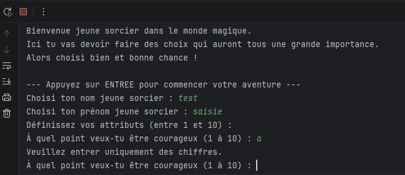
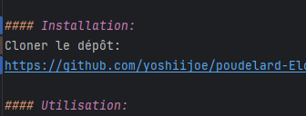
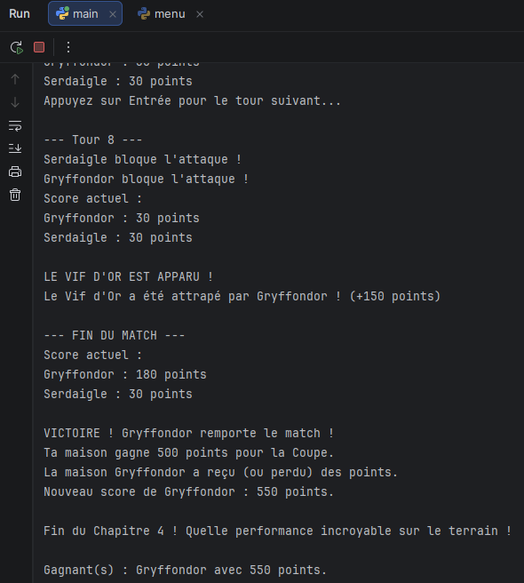

# Poudelard : L'Aventure Magique

#### Description :

Jeu de rôle textuel développé en Python où le joueur incarne un jeune sorcier.
Le jeu suit une progression en 5 chapitres : de l'achat des fournitures
sur le Chemin de Traverse jusqu'au combat final dans la Chambre des Secrets.

#### Contributeurs :

Adrien JULLIAN - Philéas ELOI

#### Installation :

1. Cloner le dépôt : https://github.com/yoshiijoe/poudelard-Eloi-Jullian-PP.git
2. Ouvrir le dossier poudelard dans votre IDE (PyCharm).

#### Utilisation :

Pour lancer le jeu, exécutez le fichier main.py à la racine du projet.

#### Fonctionnalités Principales :

- **Création de personnage** : Attributs personnalisables (courage,
intelligence, loyauté, ambition).
- **Gestion d'inventaire** : Achat dynamique via des fichiers de données JSON.
- **Cérémonie de Répartition** : Algorithme déterminant la maison selon les
choix du joueur.
- **Système de Combat** : Duel tour par tour contre le Basilic (gestion
probabilités/esquives).

#### Chronologie du Projet:

Semaine 1 : Architecture, input_utils, personnage.py et maison.py
Semaine 2 : Chapitres 1 et 2
Semaine 3 : Chapitres 3 et 4
Semaine 4 : Chapitre 5 et export final

**Répartition des Tâches :**

- **Adrien JULLIAN** : "input_utils.py", "chapitre_1.py", "chapitre_5.py", "main.py",
"menu.py".
- **Philéas ELOI** : "maison.py", "personnage.py", "chapitre_2.py", "chapitre_3.py",
"chapitre_4.py".

#### Contrôle, Tests et Validation :

Le projet utilise un module dédié "input_utils.py" pour garantir la stabilité
du programme :
- **Validation de type** : Conversion manuelle des chaînes en entiers pour
éviter les plantages.
- **Contrôle d'intervalle** : Vérification des bornes autorisées (ex: 1 à 10
pour les attributs).

**Bug connu :**

- L'affichage des emojis peut varier selon l'encodage du terminal utilisé
(UTF-8 requis).

#### Stratégies de Test :

- **Tests de saisie** : Vérification de la résistance aux entrées incorrectes
(lettres à la place de chiffres).
- **Tests de logique** : Validation de l'attribution des points de maison et de
la sélection du Choixpeau.
- **Équilibrage** : Tests statistiques sur le combat final pour garantir un
défi équitable.

